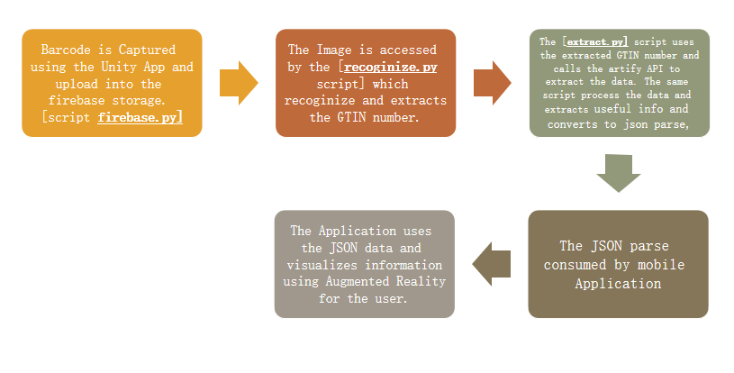
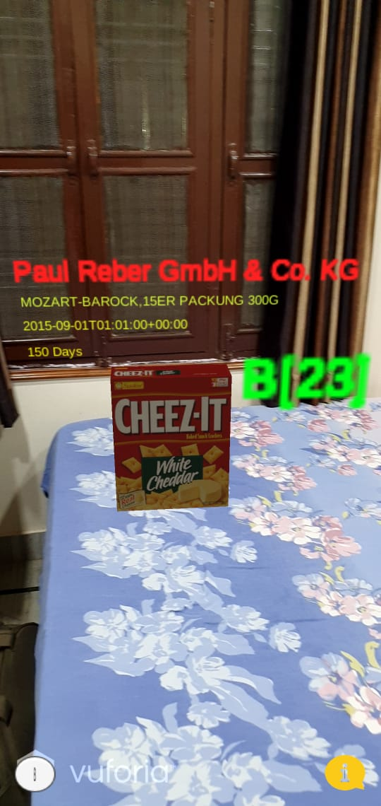
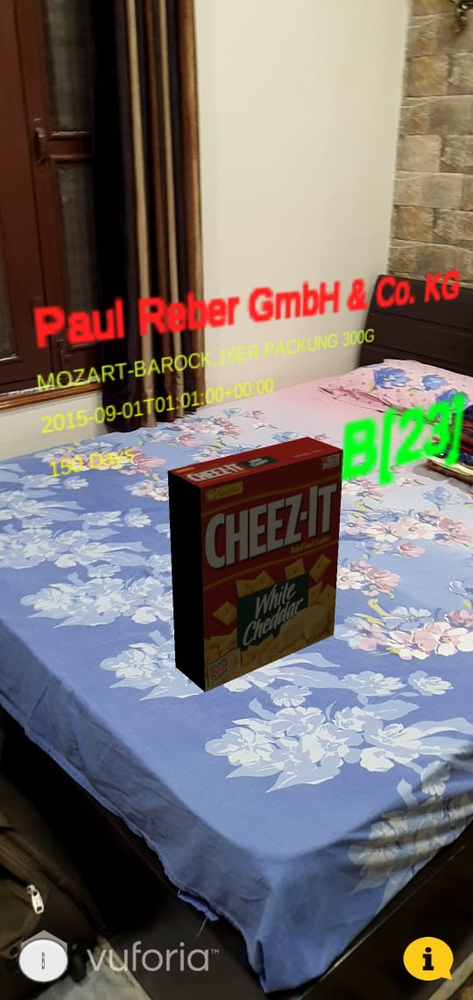
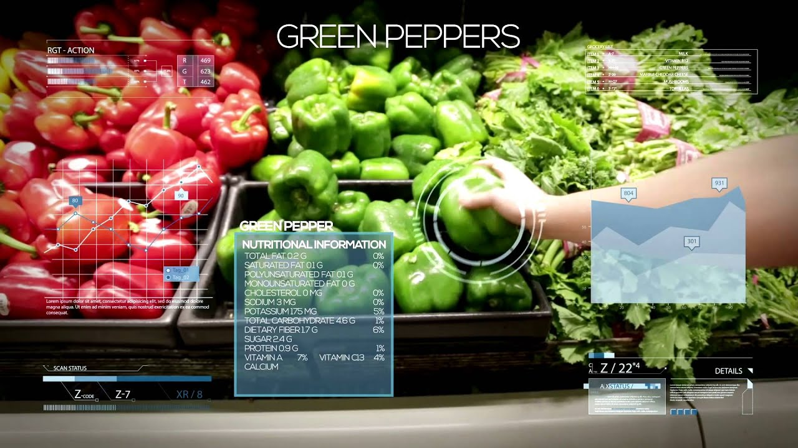

# Pixi_Best_Buy

# Inspiration :
 The problem many customers face is the usage of misleading visualization of infographics by companies on the product, to make it look attractive. Once, the product looks catchy, customers buy that product and the negatives of the products such as its nutritional values are ignored. So, with keeping that in mind, we thought of building a customer effective solution. 

# Solution :
 Once the customer captures the barcode of the product, it provides all the information aspects of the product such as it’s nutrition score, energy values, allergens, etc. , which may be ignored or may not come in the direct hindsight of customers using Augmented Reality to provide a reinvented shopping experience. 

# Outcome :

        

 <b>[Video]</b> = https://drive.google.com/file/d/1LKl_Lc1Dobi7GGCGOQqvA8llZp5OGZDn/view?usp=sharing 

 <b>[PPT]</b> = https://drive.google.com/file/d/1iXf3QdMZQ3qbHkM9lOteOKGDYRWDp3zC/view?usp=sharing 

 <b>[Full Project]</b> = https://drive.google.com/drive/folders/1Tnt44TNQUVhDom2MZAnlXgcQX0usBSBZ?usp=sharing 

# Future : 
 The next phase of development for us would be the integration of Indoor navigation using Augmented Reality and suggesting a better product based on the ingredients and Nutritional Score using machine learning. The indoor navigation can be used to guide the customer to the suggested product. 

